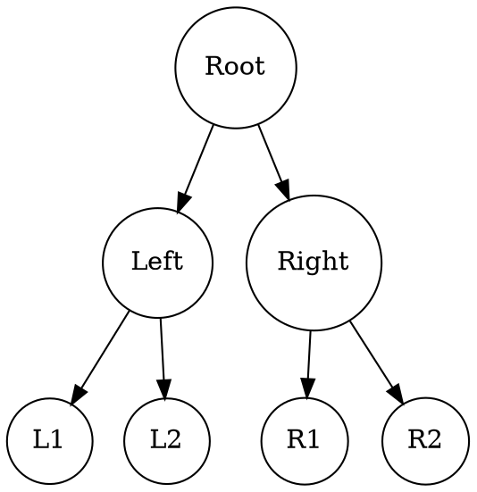

# Rehype Graphviz Diagram

This is the unified/rehype plugin that allows you transform graphviz codes into svg diagrams for html content.

## Usage

### Basic usage

This plugin make all `<code class="language-graphviz-*">` (The class could be `language-graphviz-neato` or `language-neato`, `language-graphviz-circo` or `language-circo`, `language-graphviz-dot` or `language-dot` and others suffixed by layout engine name) elements wrapped by `<pre>` replaced by a rendered version of the SVG diagram.

Input:

```html
<h1>Hello World</h1>
<pre>
  <code class="language-graphviz-*">
    <!-- Graphviz code -->
  </code>
<pre>
```

Yields:

```html
<h1>Hello World</h1>
<figure>
  <svg>
    <!-- Graphviz SVG diagram -->
  </svg>
<figure>
```

### Process markdown with `remark`

You can also integrate this rehype plugin with unified.js and remark plugins, to render graphviz diagrams in markdown.

For example, this is the markdown code with graphviz diagram use DOT engine.

````markdown

````

Then use rehype-graphviz-diagram with unified.js and other remark plugins,

```typescript
import { unified } from "unified";
import remarkParse from 'remark-parse';
import rehypeStringify from "rehype-stringify";
import remarkRehype from "remark-rehype";
import rehypeGraphvizDiagram  from "rehype-graphviz-diagram";

const output = await unified()
  .use(remarkParse, {fragment: true})
  .use(remarkRehype).use(rehypeGraphvizDiagram)
  .use(rehypeStringify)
  .process(/* Your markdown code here. */);
console.log(output.toString())
```

If you want to change another layout engine, like `circo`, `neato`, `twopi` and so on, like

````markdown
<!--    Render with circo engine.     -->
```graphviz-circo
digraph {
  ....
}
```

Or

```circo
digraph {
  ....
}
```
<!--    Render with neato engine.    -->

```graphviz-neato
digraph {
  ....
}
```

Or

```neato
digraph {
  ....
}
```
````

### Related vscode extension

We set a distinguish language annotation from codeblock different for most of plugins and extensions on marketplace. \
For better preview of graphviz diagrams when you are editing markdown in vscode, we recommend the vscode extension [Visual Studio Code Extension: Markdown Graphviz Preview](https://marketplace.visualstudio.com/items?itemName=PrinOrange.markdown-graphviz-preview)

## API

This package is **ESM only** with default export name `rehypeGraphvizDiagram`.

### `Options?`

#### `containerTagName?: string`

Specify what tag will enclose the svg image as container. Default to `figure`, namely the tag `<figure>`, it will generate such code:

```html
<figure>
  <svg>
    <!-- SVG code-->
  </svg>
</figure>
```

#### `containerTagProps?: Properties`

Optional. Add properties for container tag, it could be `class`, `style` and other more. Supports all valid DOM properties. For example,

```typescript
await unified.use(rehypeGraphvizDiagram, {
  containerTagProps: {
    class: 'graphviz',
    alt: 'This is a graphviz diagram.'
    style: 'width:100px; hight:50px',
  },
}); // ...
```

It will generate:

```html
<figure
  class="graphviz"
  alt="This is a graphviz diagram."
  style="width:100px; hight:50px"
>
  <svg>
    <!-- SVG code-->
  </svg>
</figure>
```

#### `postProcess: (svg: string) => string`

Optional. Pass a function to specify how to process the generated SVG if you need, the input and output of this function is SVG code in string form. For example,

```typescript
await unified.use(rehypeGraphvizDiagram, {
  postProcess: (svg: string) => {
    return svg.replace(/<svg/, '<svg data-processed="true"')
  };
});
```

The svg output will be

```html
<figure>
  <svg data-processed="true">
    <!-- codes -->
  </svg>
</figure>
```

## Reference

- [Visual Studio Code Extension: Markdown Graphviz Preview](https://marketplace.visualstudio.com/items?itemName=PrinOrange.markdown-graphviz-preview) Recommend to use, for better preview of graphviz diagrams when you are editing markdown in vscode.
- [Graphviz Project](https://graphviz.org/) The official project website.
- [Viz.js](https://github.com/mdaines/viz-js) The version of compiled graphviz for wasm package.

## License

MIT © [但为君故](https://github.com/PrinOrange)
