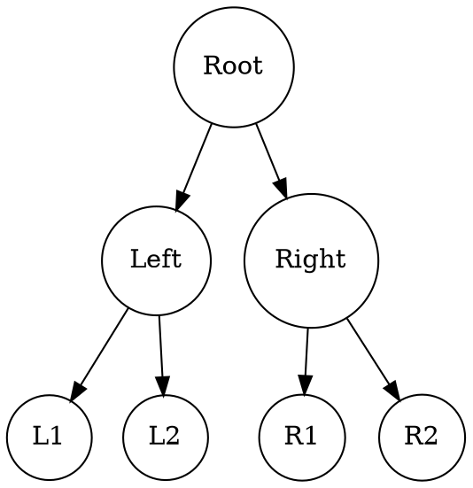

# Hello World

```graphviz-dot
digraph BinaryTree {
    node [shape=circle];

    A -> B;
    A -> C;
    B -> D;
    B -> E;
    C -> F;
    C -> G;

    A [label="Root"];
    B [label="Left"];
    C [label="Right"];
    D [label="L1"];
    E [label="L2"];
    F [label="R1"];
    G [label="R2"];
}
```
